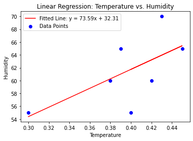

# MyCapstone

This capstone project builds a regressions to predict the humidity based on temperature coastal reasing.

## Table of Contents
- [Overview](#overview)
- [Methods](#methods)
- [Notebooks and Code](#notebooks-and-code)
- [Data](#data)
- [Plots and Graphs](#plots-and-graphs)

## Overview

Over the course of a week, scientists collected humidity readings during medium temperature days in northern California.

## Methods

Scientists used a raspberry pi with a temperature and humidity reader and placed them in sand dunes 100 meters, 50 meters, and 20 meters from the ocean and collected measurements.

## Notebooks and Code

The following notebooks contain analytical code.

### regression.ipynb

This notebook contains the code to read the regression data, buils a linear model, and create a line plot.

## Data

The data directory contains th following files:

### regression.csv

This notebook contains the code to read the regression data, build a linear model, and create a line plot

## Plots and Graphs

This graphic shows the linear relationship

He somehow added the image directly in here. look up how?

## Test Section

Setting up this section as an exercise for the class. With the following sub-sections:

### Test Sub-Section 1

This is a test again.

### Test Sub-Section 2

Still a test.
